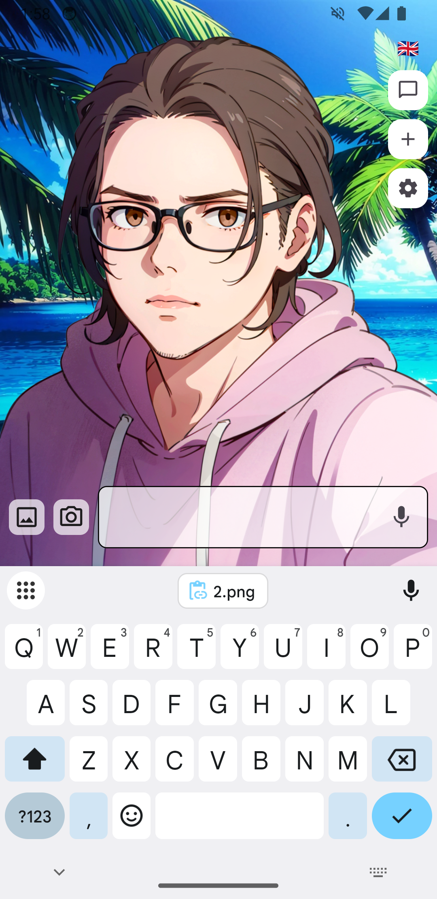
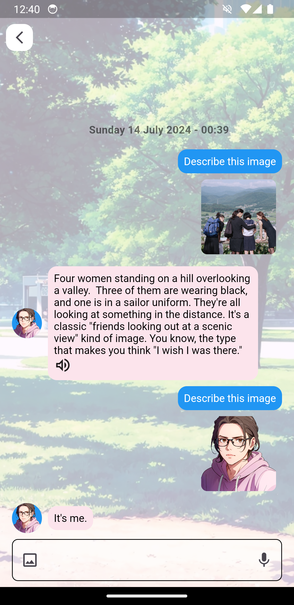
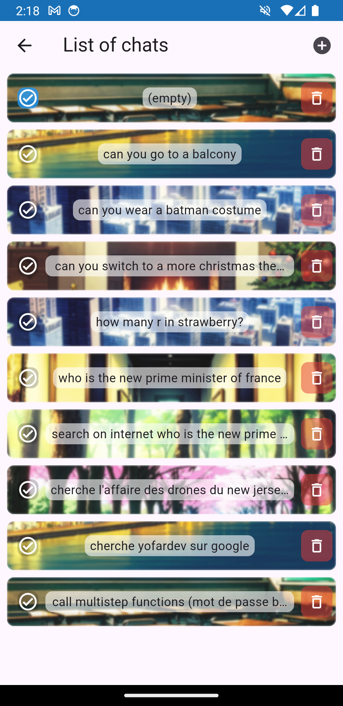

# Yofardev AI (iOS & Android)

Yofardev AI is a small fun project that brings life to a Large Language Model (LLM) through an animated avatar. Users can interact with the AI assistant through text (or dictate to text), and the app responds with generated text-to-speech and lip-synced animations.

  
  
  
  

Except for the Gemini API, everything is local. Even history of chats are only stored in the cache of the app.

## Demo Video on YouTube

## Requirements

To run the app, you can install the [apk](https://github.com/YofarDev/yofardev_ai/releases/) directly for Android, or build it yourself. To build it, you need:

- Flutter (>=3.4.3 <4.0.0)
- Android SDK (for Android builds)
- Xcode (for iOS builds)
- Google API key for Gemini 1.5-flash (you can set it up directly in app)

## Installation

1. Clone the repository:
   `git clone https://github.com/YofarDev/yofardev_ai.git`
2. Navigate to the project directory:
   `cd yofardev_ai`
3. Install dependencies:
   `flutter pub get`
4. Run the app:
   `flutter run`

## Platforms

- Android: Fully supported
- iOS: Now compatible and working (recommended voice for english is Evan-Enhanced)

## Known Issues

- The LLM currently tends to overuse sound effects for no reason. You can disable sound effects completely in the settings.
- The fading volume when the avatar is leaving and coming back is a bit glitchy (in the demo video, it was video editing because it didn't record the effect).
- Sometimes the lip-sync stop working, need to find out why.
- The batman costume is horrible

## Future Improvements

- An interrupt button to stop the AI's response mid-sentence would be a good idea.

## License

This project is licensed under the MIT License - see the [LICENSE](LICENSE) file for details.

## Tools used

- Google's Gemini 1.5-flash as backend LLM (it's actually better than I thought, and it's free)
- Text-to-speech is made localy with android's TTS engine through the flutter_tts plugin
- Stable Diffusion 1.5 for the avatar, customizations and backgrounds (AnyLora Anime Mix), with a custom LORA for the character
