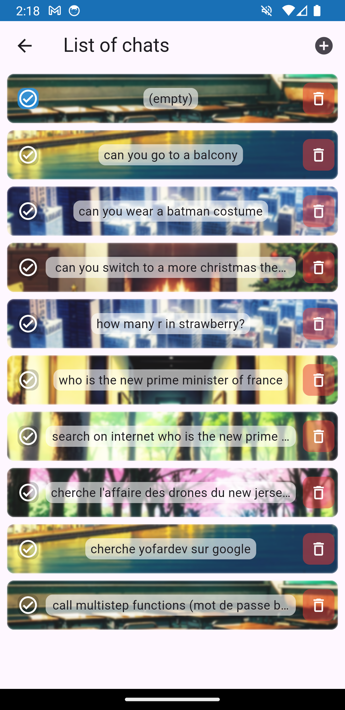
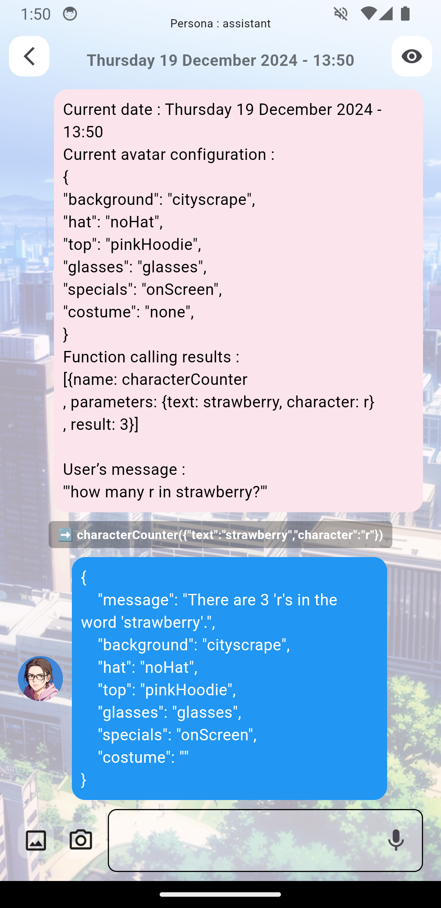
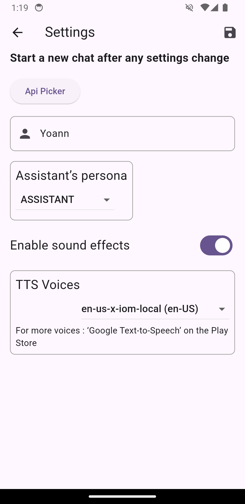
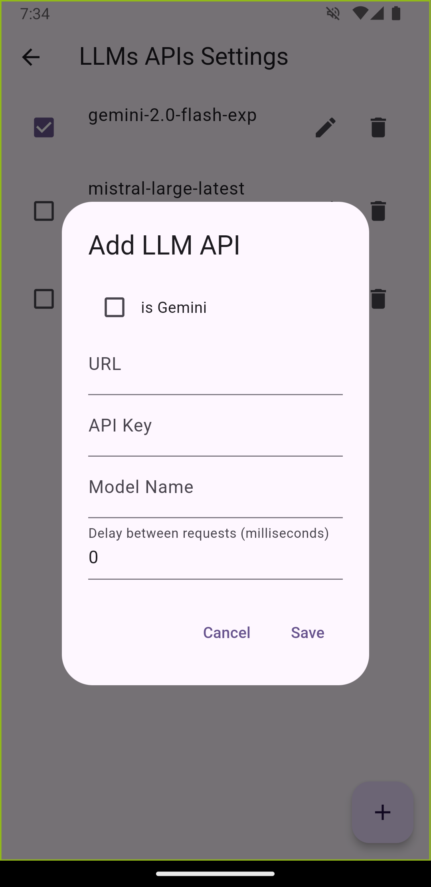

# Yofardev AI (Flutter)

Yofardev AI is a small fun (& open source) project that brings life to a Large Language Model (LLM) through an animated avatar. Users can interact with the AI assistant through text (or dictate to text), and the app responds with generated text-to-speech and lip-synced animations.

It can now call functions (like searching on internet, getting weather, etc.).

[Free web demo](https://yofardev-ai.web.app) (not all features available because of platform limitations). You need to set either a Google Api Key, or you can set up a LLM with the OpenAI format. Some functions calling won't work on this version.

Most of time, I use the Gemini flash model (1.5 or 2.0), because it's free, fast and reliable. 

Also, the app is probably only working on Android (needs to test more on iOS).

  
  
  
  

  
  
  
  

## What's New in v3.0

### Streaming & Real-time
- **Streaming LLM + TTS queue** — Real-time streaming responses with priority-based audio queue
- **Task-specific LLM configuration** — Configure different LLMs for different tasks (coding, creative, general)
- **LLM-generated chat titles** — Auto-generated titles after first message
- **Interrupt handling** — Stop button to cancel playback mid-response
- **Lip-sync animation** — Amplitude-based mouth movement

### Function Calling
- **In-app configuration** — Set API keys and enable/disable services directly in the app
- **Function calling display** — Expandable tiles show function results

### UI/UX Improvements
- **New chat animations** — Animated background transitions when creating chats
- **Demo mode** — Test conversations with JSON responses
- **Glassmorphic text field** — Modern input design
- **Voice effects** — FFmpeg post-processing for voice customization

### Localization
- **Full French/English support** — Complete translations via ARB system
- **Locale persistence** — Saves language preference

## New features in v2.0

- Function calling (work in progress, not always perfect) :
	* **`getCurrentWeather(location: string)`**
  * **`getMostPopularNewsOfTheDay()`**
  * **`searchGoogle(query: string)`**
  * And more...
 

- You can pick a persona for your assistant (normal, coach, philosopher, conservative...)
- Not limited to only Gemini. Set your OpenAI format LLM (cloud or local)
- It doesn't send a sound effect every message anymore!!

## Features

- Native text-to-speech and lip-synced animations (customizable voices)
- The assistant can switch between multiple assets (backgrounds, costumes, etc.)
- The assistant can play sound effects
- It can analyze images
- Has some specials animations and voice effects based on its costume
- History of chats (text version, stored locally)
- English and French supported

## Demo Video on YouTube

## Requirements

To run the app, you can install the [apk](https://github.com/YofarDev/yofardev_ai/releases/) directly for Android, or build it yourself (I didn't provide any api keys, so most of function calling won't work). To build it, you need:

- Flutter (>=3.8.0 <4.0.0)
- Android SDK (for Android builds)
- Api Key for a LLM service if you use a cloud service, or you can use a local one if it has the OpenAI format

## Installation

1. Clone the repository:

- `git clone https://github.com/YofarDev/yofardev_ai.git`

2. Navigate to the project directory:

- `cd yofardev_ai`

3. Install dependencies:

- `flutter pub get`

4. Configure function calling services (optional):

   The app supports function calling capabilities such as weather information, news retrieval, and web search. To enable these features:

   - Open the app and navigate to **Settings**
   - Tap on **Function Calling Configuration**
   - For each service you want to use:
     * Enter your API key
     * Enable the service toggle
   - Configured and enabled services will be available during conversations

   Supported services:
   - **OpenWeather**: For weather information (get API key at https://openweathermap.org/api)
   - **New York Times**: For news retrieval (get API key at https://developer.nytimes.com/)
   - **Google Search**: For web search (get API key and Engine ID at https://developers.google.com/custom-search/v1/overview)

5. Run the app:

- `flutter run`

## Platforms

- Android & iOS: Fully supported
- Web : some features are missing because of platform limitations.

## Known Issues

- Function calling like internet search are not always reliable.

## License

This project is licensed under the MIT License - see the [LICENSE](LICENSE) file for details.

## Tools used

- **State Management**: flutter_bloc (Cubit pattern)
- **Models**: Freezed (immutable data classes with union types)
- **Error Handling**: fpdart (Either for functional error handling)
- **DI**: get_it (service locator)
- **Routing**: go_router
- **LLM Integration**: [llm_api_picker](https://github.com/YofarDev/llm_api_picker/)
- **Avatar Generation**: Stable Diffusion 1.5 with custom LORA
