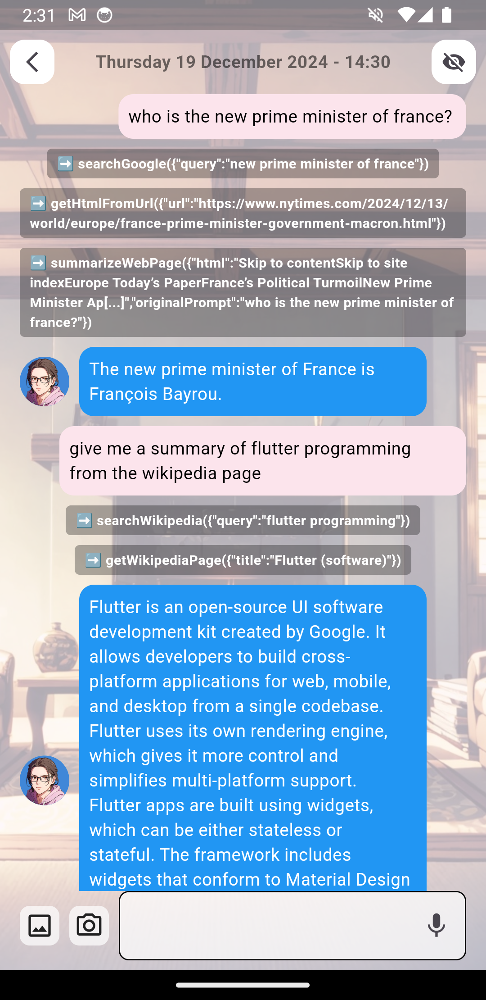

# Yofardev AI (Flutter)

Yofardev AI is a small fun (& open source) project that brings life to a Large Language Model (LLM) through an animated avatar. Users can interact with the AI assistant through text (or dictate to text), and the app responds with generated text-to-speech and lip-synced animations.

It can now call functions (like searching on internet, getting weather, etc.).

[Free web demo](https://yofardev-ai.web.app) (not all features available because of platform limitations). You need to set either a Google Api Key, or you can set up a LLM with the OpenAI format. Some functions calling won't work on this version.

Most of time, I use the Gemini flash model (1.5 or 2.0), because it's free, fast and reliable. 

Also, the app is probably only working on Android (needs to test more on iOS).

  
  
  
  

  
  
  
  

## New features in v2.0

- Function calling (work in progress, not always perfect) :
	* **`getCurrentWeather(location: string)`**
  * **`getMostPopularNewsOfTheDay()`**
	* **`searchGoogle(query: string)`**
	* And more...
	 

- You can pick a persona for your assistant (normal, coach, philosopher, conservative...)
- Not limited to only Gemini. Set your OpenAI format LLM (cloud or local)
- It doesn't send a sound effect every message anymore!!

## Features

- Native text-to-speech and lip-synced animations (customizable voices)
- The assistant can switch between multiple assets (backgrounds, costumes, etc.)
- The assistant can play sound effects
- It can analyze images
- Has some specials animations and voice effects based on its costume
- History of chats (text version, stored locally)
- English and French supported

## Demo Video on YouTube

## Requirements

To run the app, you can install the [apk](https://github.com/YofarDev/yofardev_ai/releases/) directly for Android, or build it yourself (I didn't provide any api keys, so most of function calling won't work). To build it, you need:

- Flutter (>=3.4.3 <4.0.0)
- Android SDK (for Android builds)
- Api Key for a LLM service if you use a cloud service, or you can use a local one if it has the OpenAI format

## Installation

1. Clone the repository:

- `git clone https://github.com/YofarDev/yofardev_ai.git`

2. Navigate to the project directory:

- `cd yofardev_ai`

3. Install dependencies:

- `flutter pub get`

4. (optional) Make a .env at the root of project and add your environment variables (for some function calling):

- `OPEN_WEATHER_KEY=` 
- `NEWYORKTIMES_KEY=` 
- `GOOGLE_SEARCH_KEY=` 
- `GOOGLE_SEARCH_ENGINE_ID=`

4. Run the app:

- `flutter run`

## Platforms

- Android & iOS: Fully supported
- Web : some features are missing because of platform limitations.

## Known Issues

- Function calling like internet search are not always reliable.

## License

This project is licensed under the MIT License - see the [LICENSE](LICENSE) file for details.

## Tools used

- For LLM integration I use my own package : [llm\_api_picker](https://github.com/YofarDev/llm_api_picker/)
- Stable Diffusion 1.5 for the avatar, customizations and backgrounds (AnyLora Anime Mix), with a custom LORA for the character
