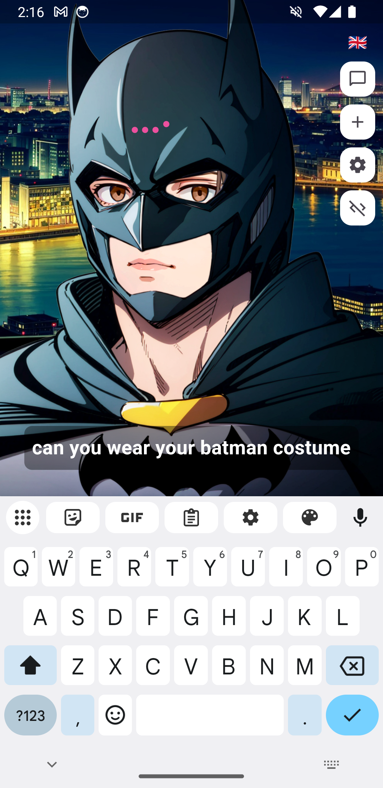

# Yofardev AI

Yofardev AI is a small fun project to kind of bring life to a Large Language Model (LLM) through an animated avatar. Users can interact with the AI assistant through text (or dictate to text), and the app responds with generated text2speech, and lip-synced animations.

  
  
  
  

## Demo

## Requirements

- Flutter (>=3.4.3 <4.0.0)
- Android SDK
- Google API key for Gemini 1.5-flash (you can set it up directly in app)

## Installation

1. Clone the repository:
   `git clone https://github.com/YofarDev/yofardev_ai.git`
2. Navigate to the project directory:
   `cd yofardev_ai`
3. Install dependencies:
   `flutter pub get`
4. Run the app:
   `flutter run`

## Known Issues

- The LLM currently tends to overuse sound effects for no reason. You can disable sound effects completely in the settings.
- The fading volume when the avatar is leaving and coming back is a bit glitchy (in the demo video, it was video editing because it didn't record the effect).
- Sometimes the lip-sync stop working, need to find out why.
- The batman costume is

## Future Improvements

- An interrupt button to stop the AI's response mid-sentence would be a good idea.
- The only reason I didn't make the app ios compatible, is because I had to write android native code to get the amplitude of audio files (for the lip-sync) and I have almost 0 experience with swift, but it may be easy to do.

## License

This project is licensed under the MIT License - see the [LICENSE](LICENSE) file for details.

## Tools used

- Google's Gemini 1.5-flash as backend LLM (it's actually better than I thought, and it's free)
- Text-to-speech is made localy with android's TTS engine through the flutter_tts plugin

Except for the Gemini API, everything is local. Even history of chats are only stored in the cache of the app.
